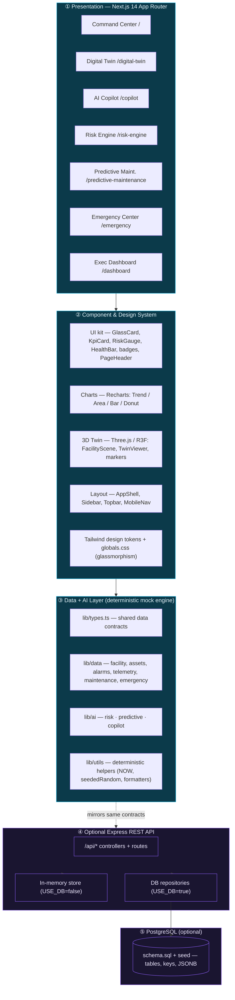

# Architecture

This document describes how **Ministry of Interior** is built: the layered architecture, the data-flow model, the deterministic-mock-AI rationale, the dual frontend-data / backend-API design, the folder structure, the key design decisions, and the path to real production data sources.

---

## 1. System overview

Ministry of Interior is a **layered Next.js 14 application** with an optional Express + PostgreSQL reference backend. The defining architectural choice is that **the frontend is fully self-contained**: it ships with a typed mock dataset and a deterministic mock AI engine, so the executive demo runs with no backend, no database and no network. The backend exists as a production-shaped reference that mirrors the exact same data contracts.

### Layered architecture (Mermaid)



### ASCII fallback

```
┌─────────────────────────────────────────────────────────────────────────┐
│  ① PRESENTATION — Next.js 14 App Router                                    │
│  /  ·  /digital-twin  ·  /copilot  ·  /risk-engine  ·                      │
│  /predictive-maintenance  ·  /emergency  ·  /dashboard                     │
└───────────────────────────────┬───────────────────────────────────────────┘
                                 │ renders
┌───────────────────────────────▼───────────────────────────────────────────┐
│  ② COMPONENT & DESIGN SYSTEM                                                │
│  UI kit (GlassCard, KpiCard, RiskGauge, HealthBar, badges, headers)        │
│  Charts (Recharts)   ·   3D Twin (Three.js / R3F)   ·   Layout shell       │
│  Tailwind design tokens + globals.css (glassmorphism, animations)          │
└───────────────────────────────┬───────────────────────────────────────────┘
                                 │ reads
┌───────────────────────────────▼───────────────────────────────────────────┐
│  ③ DATA + AI LAYER  (deterministic mock engine — the source of truth)      │
│  lib/types.ts ──── shared contracts ────────────────────────────────────┐ │
│  lib/data/*   ──── facility, assets, alarms, telemetry, maint, emergency │ │
│  lib/ai/*     ──── risk · predictive · copilot                          │ │
│  lib/utils.ts ──── NOW / seededRandom / formatters (deterministic)      │ │
└───────────────────────────────┬─────────────────────────────────────────┘ │
                                 ┊ same contracts mirrored by ↓ (optional)    │
┌───────────────────────────────▼───────────────────────────────────────────┐
│  ④ OPTIONAL EXPRESS REST API   /api/*                                       │
│        ┌── USE_DB=false → in-memory store (no database)                     │
│        └── USE_DB=true  → repositories → PostgreSQL                         │
└───────────────────────────────┬───────────────────────────────────────────┘
                                 │
┌───────────────────────────────▼───────────────────────────────────────────┐
│  ⑤ POSTGRESQL (optional)  —  schema.sql + seed (tables, keys, JSONB)        │
└─────────────────────────────────────────────────────────────────────────────┘
```

---

## 2. Data flow

In the **demo (default) path**, there is no network round-trip — the AI layer is the source of truth and the UI reads it directly at render time:

```
facility / assets / alarms / telemetry  (lib/data — typed seeds)
                │
                ▼
        AI engine (lib/ai)
   ┌────────────┼─────────────┐
   risk.ts   predictive.ts  copilot.ts
   │            │              │
 RiskAssessment PredictiveInsight[] CopilotResponse
   │            │              │
   ▼            ▼              ▼
   Server Components / Client Components
   (KPI cards, gauges, charts, tables, 3D twin, chat)
                │
                ▼
            Rendered UI
```

- **`lib/data/*`** are typed, deterministic datasets (the facility model, ~48 assets, 13 alarms, 24h energy & occupancy telemetry, 30-day trends, maintenance work orders, 4 emergency scenarios).
- **`lib/ai/*`** consume that data and compute outputs:
  - `risk.ts` → a weighted, explainable `RiskAssessment` (computed once, exported as a singleton `riskAssessment`).
  - `predictive.ts` → ranked `PredictiveInsight[]` plus a `predictiveSummary`.
  - `copilot.ts` → `copilotRespond(query)` → a grounded `CopilotResponse`.
- **Components** read these directly. Risk and predictive results are **computed once at module load** and shared app-wide — there is a single source of truth, so the Command Center, Risk Engine, Copilot and Dashboard never disagree.

In the **optional backend path**, the same contracts are served over `/api/*` (see [API.md](API.md)); a client configured with `NEXT_PUBLIC_API_BASE_URL` could fetch from the API instead of the local engine without any UI changes.

---

## 3. Why a *deterministic* mock AI engine

The "AI" here is a transparent, rules-and-math engine — not a stochastic model — and that is a deliberate, load-bearing decision for a **demo-grade product**:

| Concern | How determinism helps |
|---------|----------------------|
| **Reproducible demos** | The same risk score (~64, High), the same UPS-A1 prediction (4 days), the same copilot answers — every single run. Presenters can rehearse with confidence. |
| **No SSR hydration bugs** | Next.js renders on the server then hydrates on the client. Any `Math.random()` or `Date.now()` at module/render scope would produce different server vs client output and crash hydration. The codebase **forbids** this. |
| **Explainability** | Because risk is a weighted blend with named signals, every number is auditable — exactly what executives in a security context demand. |
| **Zero dependencies** | No API keys, no model hosting, no rate limits, no cost. The demo runs on a plane. |
| **Swap-ability** | Each engine is a pure function behind a typed contract. Replacing `computeRiskAssessment()` with a real ML inference call, or `copilotRespond()` with an LLM + RAG call, changes nothing upstream in the UI. |

**Determinism enforcement.** Instead of `new Date()` / `Date.now()` / `Math.random()`, the code uses helpers from `lib/utils`:

- `NOW` / `NOW_ISO` — a single fixed "current time" reference.
- `seededRandom(seed)` — a seeded PRNG, so "noise" in telemetry is stable.
- `isoMinusHours` / `isoMinusDays` / `isoPlusDays` — time math relative to `NOW`.

The risk engine is the clearest example of the explainable design — a weighted composite of four domains:

```ts
// lib/ai/risk.ts — domain weights (sum to 1.0)
const WEIGHTS = {
  equipment: 0.40,   // critical/offline/warning assets + near-term predicted failures
  security:  0.30,   // active security/access/network alarms + surveillance gaps
  energy:    0.16,   // consumption vs AI baseline + environmental anomalies
  occupancy: 0.14,   // zone anomalies + over-capacity floors
};

// each domain → a 0–100 sub-score with traceable `signals[]`
// overall = Σ (sub-score × weight)  → categorized Low/Guarded/Elevated/High/Severe
// confidence reported at 0.88
```

---

## 4. The dual design: frontend data + backend API

The repository ships **two implementations of the same data contracts**, by design:

| | `frontend/lib` (demo) | `backend/` (reference) |
|---|----------------------|------------------------|
| **Purpose** | Frictionless executive demo | Production-shaped data path |
| **Runtime** | In-browser / Next.js server | Node.js + Express |
| **Storage** | Typed in-code seeds | In-memory **or** PostgreSQL |
| **Dependencies** | None | Node (+ PostgreSQL if `USE_DB=true`) |
| **Contracts** | `lib/types.ts` | Mirrors the same TypeScript shapes |

This decouples the *demo experience* (which must be instant and offline) from the *integration story* (which must look like real infrastructure). The single shared contract — the entities in [`DATA_MODEL.md`](DATA_MODEL.md) — is what guarantees they stay consistent.

---

## 5. Folder structure

```
Dubai Police/
├── README.md
├── docs/                          ← this documentation suite
├── frontend/
│   ├── app/
│   │   ├── layout.tsx             ← root layout (AppShell, fonts, globals)
│   │   ├── globals.css            ← design tokens, .glass, animations
│   │   ├── page.tsx               ← Module 01 · Command Center
│   │   ├── digital-twin/page.tsx  ← Module 02 · 3D Digital Twin
│   │   ├── copilot/page.tsx       ← Module 03 · AI Copilot
│   │   ├── risk-engine/page.tsx   ← Module 04 · Risk Engine
│   │   ├── predictive-maintenance/page.tsx  ← Module 05
│   │   ├── emergency/page.tsx     ← Module 06 · Emergency Center
│   │   └── dashboard/page.tsx     ← Module 07 · Executive Dashboard
│   ├── components/
│   │   ├── ui/                    ← GlassCard, KpiCard, RiskGauge, HealthBar,
│   │   │                            Sparkline, AnimatedNumber, badges, headers, Motion
│   │   ├── charts/                ← TrendArea, TrendLine, CategoryBar, Donut, tooltip
│   │   ├── twin/                  ← FacilityScene, TwinViewer, markers (3D)
│   │   ├── panels/                ← AlarmFeed
│   │   └── layout/                ← AppShell, Sidebar, Topbar, MobileNav
│   ├── lib/
│   │   ├── types.ts               ← all shared domain + AI contracts
│   │   ├── nav.ts                 ← navItems (the 7 modules)
│   │   ├── utils.ts               ← deterministic helpers + formatters + meta maps
│   │   ├── data/                  ← facility, assets, alarms, telemetry,
│   │   │                            maintenance, emergency (+ index)
│   │   └── ai/                    ← risk, predictive, copilot (+ index)
│   ├── tailwind.config.ts         ← design tokens (ink, command, cognition, risk, status)
│   ├── tsconfig.json              ← path alias "@/*" → frontend root
│   └── package.json
└── backend/                       ← optional Express + PostgreSQL reference API
    ├── src/                       ← app, routes, controllers, repositories
    └── db/                        ← schema.sql, seed
```

---

## 6. Key design decisions

1. **Single source of truth for AI outputs.** `riskAssessment`, `predictiveInsights` and `predictiveSummary` are computed once at module load and imported everywhere, so no two screens can disagree about the state of the facility.
2. **Typed contracts first.** `lib/types.ts` defines every entity and AI output before any data or UI exists. The frontend mock data, the AI engine and the backend all conform to it.
3. **Determinism as a hard rule.** No `Math.random()` / `Date.now()` / argless `new Date()` at module or render scope — enforced via `NOW`, `seededRandom` and time helpers — to guarantee SSR-safe, reproducible output.
4. **Server components by default, client only where needed.** Pages render on the server; only interactive pieces (3D twin, charts, gauges, animated numbers, the copilot chat, the risk simulator) opt into `'use client'`.
5. **Design system over ad-hoc styling.** A small set of glassmorphic primitives (`GlassCard`, `KpiCard`, `RiskGauge`, `HealthBar`, badges) and Tailwind tokens (`ink`, `command`, `cognition`, `risk`, `status`) keep all seven modules visually coherent and executive-grade.
6. **Client-only 3D.** The digital twin is dynamically imported with `ssr: false` and a loader, because WebGL/Three.js cannot render on the server.
7. **Mock-but-real-shaped.** The mock data uses real manufacturers, models, MTBF, telemetry fields and a coherent incident storyline so the demo is credible, not lorem-ipsum.
8. **Optional, isolated backend.** The Express API and PostgreSQL schema are a separate deliverable that never blocks the demo.

---

## 7. Extending to real data in production

Because each mock module sits behind a typed contract, productionizing is a matter of **replacing sources, not rewriting the app**. The mapping:

| Demo component | Production source | Integration approach |
|----------------|-------------------|----------------------|
| `lib/data/telemetry.ts` (energy, occupancy) | **BMS / SCADA**, smart meters, people-counting | Stream via MQTT / BACnet / Modbus → time-series store (e.g. TimescaleDB / InfluxDB) → API. |
| `lib/data/assets.ts` (status, health, telemetry) | **BMS + IoT sensors** + CMMS asset registry | Per-asset live tags + nameplate data from the asset register. |
| `lib/data/alarms.ts` | **VMS, ACS, fire panel, BMS alarm buses** | Normalize heterogeneous alarm feeds into the `Alarm` contract. |
| Camera markers / coverage in the twin | **VMS** (e.g. Milestone, Genetec, Axis) | Bind markers to camera IDs; deep-link to live feeds. |
| Access events / occupancy anomalies | **ACS** (e.g. HID, LenelS2) | Subscribe to read/deny events and door states. |
| `lib/ai/risk.ts` | Keep the explainable weighted model **or** layer a learned model | The weighted blend remains as the auditable baseline; learned signals feed in as additional domains. |
| `lib/ai/predictive.ts` | **Real RUL / anomaly-detection ML** | Replace the heuristic with trained models per asset class; the `PredictiveInsight` contract is unchanged. |
| `lib/ai/copilot.ts` | **LLM + RAG** over facility data | Swap the intent engine for retrieval-augmented generation grounded on the same live entities; keep citations. |
| 3D twin geometry | **BIM / IFC** model import | Replace the procedural slab layout with the building's real BIM geometry. |
| In-code seeds → API | The Express API (`USE_DB=true`) | Point the frontend at `NEXT_PUBLIC_API_BASE_URL`; the contracts already match. |

The detailed, phased plan for this — live integrations, real ML, multi-site federation, BIM-driven twins, RBAC, compliance and edge analytics — is in the [Roadmap](ROADMAP.md).
