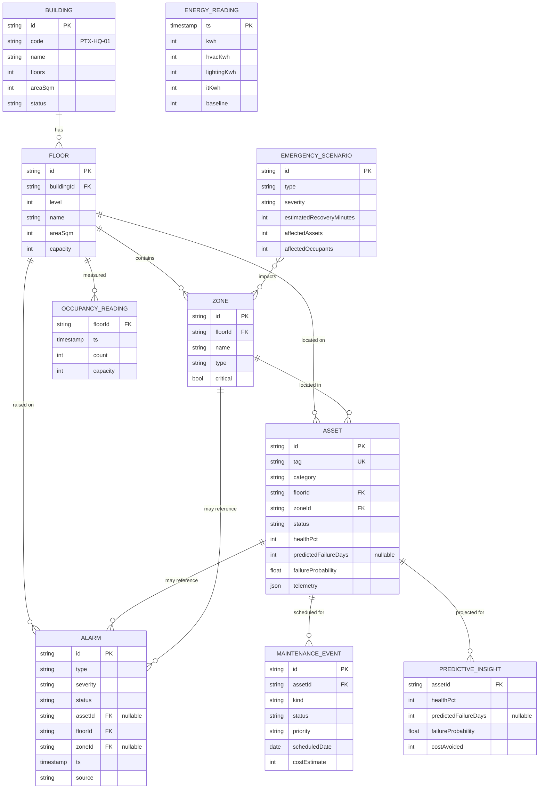

# Data Model

This document describes the Ministry of Interior domain model — the entities, their relationships, and the PostgreSQL schema used by the optional backend. The TypeScript definitions in `frontend/lib/types.ts` are the **single shared contract**: the frontend mock data, the AI engine and the backend all conform to it, and the PostgreSQL schema in `backend/db/schema.sql` is a faithful relational projection of it.

---

## 1. Entity overview

| Entity | Represents | Key fields |
|--------|-----------|------------|
| **Building** | The facility itself (Central Command HQ). | `id`, `code` (`PTX-HQ-01`), `name`, `areaSqm`, `floors`, `status` |
| **Floor** | One of the 6 levels (B1 → L5). | `id`, `buildingId`, `level`, `name`, `areaSqm`, `capacity` |
| **Zone** | A functional area within a floor. | `id`, `floorId`, `name`, `type`, `critical` |
| **Asset** | A piece of building equipment (~48 total). | `id`, `tag`, `category`, `floorId`, `zoneId`, `status`, `healthPct`, predictive fields, `telemetry` (JSON) |
| **Alarm** | An incident / event in the stream (13 total). | `id`, `type`, `severity`, `status`, `assetId?`, `floorId`, `timestamp`, `source` |
| **EnergyReading** | One hourly energy sample (24/day). | `timestamp`, `kwh`, `hvacKwh`, `lightingKwh`, `itKwh`, `baseline` |
| **OccupancyReading** | Occupancy count for a floor at a time. | `floorId`, `timestamp`, `count`, `capacity` |
| **MaintenanceEvent** | A work order (predictive / preventive / corrective). | `id`, `assetId`, `kind`, `status`, `priority`, `scheduledDate`, `costEstimate` |
| **RiskAssessment** | The computed explainable risk output. | `score`, `category`, `factors[]`, `recommendations[]`, `confidence` |
| **PredictiveInsight** | A ranked at-risk asset projection. | `assetId`, `healthPct`, `predictedFailureDays`, `failureProbability`, `costAvoided` |
| **EmergencyScenario** | A pre-modeled crisis + response playbook (4 total). | `id`, `type`, `severity`, `impactedZones[]`, `responsePlan[]`, `estimatedRecoveryMinutes` |

### Relationships at a glance

- A **Building** has many **Floors**; a **Floor** has many **Zones**.
- An **Asset** belongs to one **Floor** and one **Zone**.
- An **Alarm** references a **Floor** (always) and optionally an **Asset** and a **Zone**.
- An **EnergyReading** is facility-wide (timestamped); an **OccupancyReading** belongs to a **Floor**.
- A **MaintenanceEvent** references an **Asset**.
- **RiskAssessment** and **PredictiveInsight** are **derived** (computed by the AI layer) from Assets, Alarms and telemetry — not primary stored entities in the demo (they are computed; the backend may cache them).
- An **EmergencyScenario** references **Zones** (via its impacted-zones list).

---

## 2. ER diagram



---

## 3. Enumerations

The model leans on a set of closed enums (TypeScript union types → PostgreSQL `CHECK` constraints or `ENUM` types):

| Enum | Values |
|------|--------|
| `Severity` | `critical` · `high` · `medium` · `low` |
| `AssetStatus` | `operational` · `warning` · `critical` · `offline` |
| `AssetCategory` | `HVAC` · `UPS` · `Electrical` · `FireSystem` · `Camera` · `AccessControl` · `Sensor` · `Network` |
| `AlarmType` | `fire` · `security` · `maintenance` · `power` · `access` · `environmental` · `network` |
| `AlarmStatus` | `active` · `acknowledged` · `resolved` |
| `RiskCategory` | `Low` · `Guarded` · `Elevated` · `High` · `Severe` |
| `RiskDomain` | `security` · `energy` · `equipment` · `occupancy` |
| `MaintenanceKind` | `predictive` · `preventive` · `corrective` |
| `MaintenanceStatus` | `scheduled` · `in_progress` · `completed` · `overdue` |
| `Zone.type` | `operations` · `detention` · `evidence` · `server` · `public` · `admin` · `utility` · `parking` · `armory` |
| `EmergencyType` | `fire` · `power_outage` · `unauthorized_access` · `equipment_failure` |

---

## 4. PostgreSQL schema summary

The backend's `db/schema.sql` projects the domain model into relational tables. Highlights:

- **String primary keys** matching the in-app ids (`bld-hq-01`, `flr-03`, `flr-03-z1`, `ast-001`, `alm-001`, `mx-001`, `scn-fire`) so data is portable between in-memory and DB modes.
- **Foreign keys** enforce the containment hierarchy (floor → building, zone → floor, asset → floor + zone, etc.).
- **`JSONB` columns** for the flexible / nested structures: asset `telemetry`, and the nested arrays on risk and emergency records (factors, recommendations, impacted zones, response plans).
- **`CHECK` constraints** (or native `ENUM` types) enforce the enumerations above.
- **Indexes** on the common filter columns (`asset.status`, `asset.category`, `asset.floor_id`, `alarm.status`, `alarm.severity`, `alarm.type`, `maintenance_event.status`).

### Table summary

| Table | PK | Notable FKs | JSONB | Notes |
|-------|----|-------------|-------|-------|
| `building` | `id` | — | — | One row (Central Command HQ). |
| `floor` | `id` | `building_id → building` | — | 6 rows, `level` from -1 to 4. |
| `zone` | `id` | `floor_id → floor` | — | 4 zones per floor; `critical` boolean. |
| `asset` | `id` | `floor_id → floor`, `zone_id → zone` | `telemetry` | `tag` is unique; predictive fields nullable. |
| `alarm` | `id` | `floor_id → floor`, `asset_id → asset` (null), `zone_id → zone` (null) | — | `timestamp` indexed for the event stream. |
| `energy_reading` | `(timestamp)` | — | — | 24 hourly rows; `baseline` for anomaly detection. |
| `occupancy_reading` | `(floor_id, timestamp)` | `floor_id → floor` | — | Per-floor counts vs capacity. |
| `maintenance_event` | `id` | `asset_id → asset` | — | Work orders; `cost_estimate`, `estimated_hours`. |
| `emergency_scenario` | `id` | — | `impacted_zones`, `response_plan`, `cascade_risks` | 4 pre-modeled scenarios. |
| `risk_assessment` *(optional cache)* | `(generated_at)` | — | `factors`, `recommendations` | Derived; may be recomputed rather than stored. |

### Illustrative DDL

```sql
-- Floors of the building
CREATE TABLE floor (
  id          TEXT PRIMARY KEY,
  building_id TEXT NOT NULL REFERENCES building(id),
  level       INTEGER NOT NULL,
  name        TEXT NOT NULL,
  area_sqm    INTEGER NOT NULL,
  capacity    INTEGER NOT NULL
);

-- Geolocated, health-tracked assets with flexible telemetry
CREATE TABLE asset (
  id                     TEXT PRIMARY KEY,
  tag                    TEXT UNIQUE NOT NULL,
  name                   TEXT NOT NULL,
  category               TEXT NOT NULL
                           CHECK (category IN ('HVAC','UPS','Electrical','FireSystem',
                                               'Camera','AccessControl','Sensor','Network')),
  floor_id               TEXT NOT NULL REFERENCES floor(id),
  zone_id                TEXT NOT NULL REFERENCES zone(id),
  position               JSONB NOT NULL,            -- { x, y, z } twin coordinates
  status                 TEXT NOT NULL
                           CHECK (status IN ('operational','warning','critical','offline')),
  health_pct             INTEGER NOT NULL CHECK (health_pct BETWEEN 0 AND 100),
  manufacturer           TEXT,
  model                  TEXT,
  install_date           DATE,
  last_service_date      DATE,
  predicted_failure_days INTEGER,                   -- NULL = no near-term prediction
  failure_probability    NUMERIC(4,3) NOT NULL,     -- 0.000–1.000
  mtbf_days              INTEGER NOT NULL,
  recommendation         TEXT,
  telemetry              JSONB NOT NULL DEFAULT '{}'::jsonb
);
CREATE INDEX idx_asset_status   ON asset(status);
CREATE INDEX idx_asset_category ON asset(category);
CREATE INDEX idx_asset_floor    ON asset(floor_id);

-- Incident / event stream
CREATE TABLE alarm (
  id          TEXT PRIMARY KEY,
  type        TEXT NOT NULL,
  severity    TEXT NOT NULL CHECK (severity IN ('critical','high','medium','low')),
  title       TEXT NOT NULL,
  message     TEXT NOT NULL,
  asset_id    TEXT REFERENCES asset(id),
  floor_id    TEXT NOT NULL REFERENCES floor(id),
  zone_id     TEXT REFERENCES zone(id),
  status      TEXT NOT NULL CHECK (status IN ('active','acknowledged','resolved')),
  ts          TIMESTAMPTZ NOT NULL,
  source      TEXT NOT NULL,
  acknowledged_by TEXT
);
CREATE INDEX idx_alarm_status   ON alarm(status);
CREATE INDEX idx_alarm_severity ON alarm(severity);
CREATE INDEX idx_alarm_ts       ON alarm(ts DESC);

-- Pre-modeled crises with nested playbooks (JSONB)
CREATE TABLE emergency_scenario (
  id                         TEXT PRIMARY KEY,
  type                       TEXT NOT NULL,
  name                       TEXT NOT NULL,
  severity                   TEXT NOT NULL,
  description                TEXT,
  trigger_narrative          TEXT,
  impacted_zones             JSONB NOT NULL,   -- EmergencyImpactZone[]
  response_plan              JSONB NOT NULL,   -- EmergencyResponseStep[]
  estimated_recovery_minutes INTEGER NOT NULL,
  affected_assets            INTEGER NOT NULL,
  affected_occupants         INTEGER NOT NULL,
  cascade_risks              JSONB NOT NULL    -- string[]
);
```

---

## 5. Why JSONB?

Several entities carry **nested, variable-shape** data that maps awkwardly to flat columns and is always read as a whole:

- **`asset.telemetry`** — the field set differs by category (a UPS reports `batteryPct` / `loadPct` / `runtimeMin`; a camera reports `fps` / `uptimePct` / `retentionDays`). JSONB keeps this flexible without a sparse, ever-growing column set.
- **`emergency_scenario.response_plan` / `impacted_zones` / `cascade_risks`** — ordered arrays of structured steps and zones, always consumed together as a playbook.
- **`risk_assessment.factors` / `recommendations`** (if cached) — nested arrays produced atomically by the engine.

This keeps the relational core clean (buildings, floors, zones, assets, alarms, readings, work orders) while letting the genuinely document-shaped, derived data live in JSONB — and PostgreSQL's JSONB indexing remains available if those fields ever need to be queried.

---

## 6. Reference dataset (Central Command HQ)

| Dimension | Value |
|-----------|-------|
| Building | Central Command HQ · `PTX-HQ-01` · ~42,800 m² |
| Floors | 6 (B1 Plant · L1 Public · L2 Operations/Dispatch · L3 Investigations · L4 Detention · L5 Secure Core) |
| Zones | 4 per floor (24 total) |
| Assets | ~48 across 8 categories |
| Alarms | 13 (active / acknowledged / resolved) |
| Energy | 24 hourly readings + 4-way breakdown |
| Maintenance | 11 work orders (predictive / preventive / corrective) |
| Emergency scenarios | 4 (fire · power outage · unauthorized access · equipment failure) |
| Trends | 30-day risk / alarms / energy / asset-health series |
